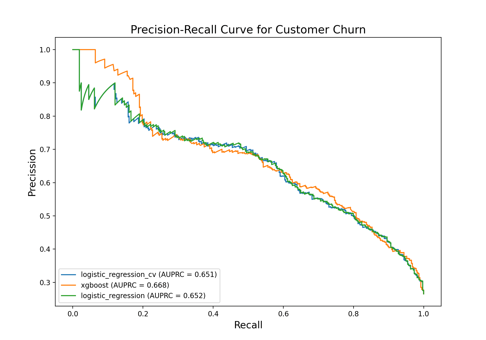

# Telco Customer Churn Prediction

This project aims to predict customer churn for a fictional Telco company that provided home phone and internet services to 
7043 customers. By analyzing customer data, we can identify the factors that contribute to churn. We hope that we can build
a model that can predict which customers are likely to leave

### Table of Contents

* [Introduction](#introduction)
* [Features](#features)
* [Project Structure](#project-structure)
* [Getting Started](#getting-started)
* [Usage](#usage)
* [Configuration](#configuration)
* [Model Performance](#model-performance)

### Introduction

Customer churn is a major challenge for telecommunications companies. Retaining existing customers is crucial for profitability.
This project addresses the challenge by building a machine learning model that can predict customer churn based on their
service usage data and demographics.

### Features

#### Exploratory Data Analysis

The EDA revealed several important things about the dataset:

* Class Imbalance: the dataset is imbalanced, there are three times more loyal customers than churners
* Churner profile: customers that are on flexible month-to-month contracts for premium internet services, like Fiber Optic
* There is a multicollinearity issue, between tenure and TotalCharges

In [data_processing.py](src/data_processing.py) I spent a significant amount of time trying to clean the data and preprocess it.
In there you could see the following:
* Handling missing values: the TotalCharges column had 11 empty strings which were parse to numeric and where empty values were encountered those were filled with zeros
* Feature engineering: I separated the input data columns in three types, numeric, binary and multiclass and applied different preprocessing steps
  * Numeric features: missing data was imputed with a constant value 0 and all data scaled with StandardScaler
  * Binary features: encoded using OrdinalEncoder into 0s and 1s
  * Categorical features: encode using OneHotEncoder, one hot encoding the data dropping the first category column to avoid redundancy


### Project Structure

The project is organized as follows:
```
.
├── README.md
├── config
│   ├── base_config.yaml
│   ├── logistic_regression.yaml
│   ├── logistic_regression_cv.yaml
│   └── xgboost.yaml
├── data
│   ├── processed
│   │   ├── X_test.csv
│   │   └── y_test.csv
│   └── raw
│       └── WA_Fn-UseC_-Telco-Customer-Churn.csv
├── models
│   ├── logistic_regression.joblib
│   ├── logistic_regression_cv.joblib
│   └── xgboost.joblib
├── notebooks
│   └── 01_Exploratory_Data_Analysis.ipynb
├── requirements.txt
└── src
    ├── data_processing.py
    ├── evaluate.py
    ├── train.py
    └── utils.py
```
* `config` contains YAML files for configuring the models and data paths
* `data` where the raw and processed data is stored
* `models` where the trained models are stored
* `notebooks` contains Jupyter Notebook for EDA
* `src` python source code for data processing, training and evaluation
* `requirements.txt` required packages for this project

### Getting Started

In order to get this up and running please do the following:

#### Pre-requisites:

* Python 3.x
* pip

#### Pre-requisites:

1. Clone the repo
    `https://github.com/RaresPopa22/TelcoCustomerChurn`
2. Install Python packages
    `pip install -r requirements.txt`
3. Download the dataset
    Download the dataset 'Credit Card Fraud' from [Kaggle](https://www.kaggle.com/datasets/blastchar/telco-customer-churn#:~:text=Download)


#### Usage

You can choose to train the models, or use the saved models, and evaluate their performance using the script in the src/
directory.

#### Training the Models

In order to train a model, run the `train.py` script with the desired configuration:

* Train Logistic Regression with hyperparameter search
    `python -m src.train --config config/logistic_regression.yaml`
* Train Logistic Regression CV
    `python -m src.train --config config/logistic_regression_cv.yam`
* Train xgboost with RandomizedSearchCV hyperparameter tuning:
    `python -m src.train --config config/xgboost.yaml`

#### Evaluating the models

After training, you can evaluate and compare the models using the evaluate.py script:
    `python -m src.evaluate --models models/logistic_regression_cv.joblib models/xgboost.joblib models/logistic_regression.joblib --x-test data/X_test.csv --y-test data/y_test.csv`

This will print a classification report for each model, a comparison summary, and will plot a Precision-Recall curve plot.

### Configuration

This project uses YAML files for configuration, making it easy to manage model parameters and data paths.

* `base_config.yaml` contains the base configuration, including data paths
* `logistic_regression.yaml`, `logistic_regression_cv.yaml` and `xgboost.yaml` contains model-specific parameters

### Model Performance

To get an accurate evaluation of the performance, 20% of the original data was held out in training phase (an extra of 
16% from the original data in the case of XGBoost for the eval set). This was done to assess the models' performance on
unseen data. The main metrics used for comparison are the Area Under the Precision-Recall Curve (AUPRC) and F1-score.

The table below summarizes the performance of the trained models:

| Model   | AUPRC  | ROC AUC      | Recall (Churn) | Precision (Churn) | F1-Score (Churn) |
|---------|--------|--------------|----------------|-------------------|------------------|
| logistic_regression_cv | 0.6510 | 0.8338 |  0.78          | 0.51 |  0.62 |
| xgboost | 0.6684 | 0.8374  |  0.81         | 0.50 |  0.62 |
| logistic_regression    | 0.6522 |  0.8342 |  0.79          |  0.51  | 0.62 |


The output sets a clear winner, XGBoost, slightly outperforming the other models in terms of AUPRC and recall. There is 
a tie in terms of F1-score.

All models perform well, which could serve as evidence that the data processing was effective.

I will end this section with the Precision-Recall curve for all three models:



While numerically XGBoost is the best, we can see that all three models have learns the patterns in data effectively and 
demonstrate a good ability to distinguish between churning and loyal customers


